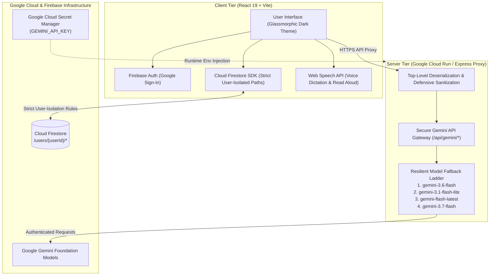

# ReflectAI - User-Authenticated Journaling with Gemini & Cloud Firestore

[](https://react.dev/)
[](https://firebase.google.com/)
[](https://cloud.google.com/run)
[](https://ai.google.dev/)

ReflectAI is a full-stack, user-authenticated reflection and journaling application built with React, Node.js/Express, Cloud Firestore, and the Gemini 3.6 Flash API. It provides a private, user-isolated sanctuary where users can write multi-turn journal reflections, receive empathetic insights, brainstorm creative paths forward, and generate structured executive summaries.

---

## Application Previews

### Main Dashboard & Emotional Pulse


### Reflection Editor & Mood Analytics


### Technical Mentor AI Mode


---

## Architecture & Security Model

### End-to-End System Architecture



---

## Prerequisites & Environment Setup

1. **Google Cloud Project**: An active GCP project with billing enabled.
2. **Google Cloud SDK (`gcloud` CLI)**: Installed and authenticated (`gcloud auth login`).
3. **Enable Required Google Cloud APIs**:
   ```bash
   gcloud services enable \
     run.googleapis.com \
     secretmanager.googleapis.com \
     firestore.googleapis.com
   ```

---

## Secret Management Setup

ReflectAI adheres to zero-hardcoding hygiene. Sensitive credentials such as `GEMINI_API_KEY` are stored in Google Cloud Secret Manager and accessed via runtime environment injection.

### 1. Create and Populate the Secret
```bash
# Create the secret definition in Secret Manager
gcloud secrets create GEMINI_API_KEY --replication-policy="automatic"

# Inject your Gemini API key value
echo -n "YOUR_GEMINI_API_KEY" | gcloud secrets versions add GEMINI_API_KEY --data-file=-
```

### 2. Grant Cloud Run Service Account Secret Access
```bash
# Retrieve your project number
PROJECT_NUMBER=$(gcloud projects describe $(gcloud config get-value project) --format="value(projectNumber)")

# Grant Secret Accessor role to the default compute service account
gcloud secrets add-iam-policy-binding GEMINI_API_KEY \
  --member="serviceAccount:${PROJECT_NUMBER}-compute@developer.gserviceaccount.com" \
  --role="roles/secretmanager.secretAccessor"
```

---

## Database Security Configuration (Cloud Firestore)

All user reflections and interaction records are strictly isolated under `/users/{userId}/*`. The following security rules enforce zero-trust access control:

```javascript
rules_version = '2';
service cloud.firestore {
  match /databases/{database}/documents {
    // Default-deny all unauthenticated or unmatched access
    match /{document=**} {
      allow read, write: if false;
    }

    // User data isolation: authenticated users can only access their own records
    match /users/{userId} {
      allow read, write: if request.auth != null && request.auth.uid == userId;

      // Isolated journal reflections & multi-turn dialogs
      match /entries/{entryId} {
        allow read, write: if request.auth != null && request.auth.uid == userId;
      }

      // Isolated audit logs of prompt/response interactions
      match /interactions/{interactionId} {
        allow read, write: if request.auth != null && request.auth.uid == userId;
      }
    }
  }
}
```

To deploy these rules using the Firebase CLI:
```bash
firebase deploy --only firestore:rules
```

---

## Google Cloud Run Deployment Flow

Deploy the application as a containerized service directly to Google Cloud Run:

```bash
# Build and deploy service to Cloud Run
gcloud run deploy reflectai-app \
  --source . \
  --region asia-southeast1 \
  --platform managed \
  --allow-unauthenticated \
  --set-secrets="GEMINI_API_KEY=GEMINI_API_KEY:latest" \
  --port 3000
```

### Mandatory Campaign Verification Labeling
To register the service for automated challenge verification:

```bash
gcloud run services update reflectai-app \
  --update-labels=dev-tutorial=cloud-run-ai-challenge \
  --region=asia-southeast1
```

---

## Comprehensive Functional Walkthrough & Test Specifications

The following test suites describe every user interaction and system process for automated test scripts or manual verification:

### Test Suite 1: Authentication & Landing Page Flow
* **TC-1.1 Unauthenticated Landing**: Open the root URL (`/`). Verify that the landing hero is displayed with security badges, explanation of user-isolated storage, and a prominent "Sign In with Google" button. Verify that the private dashboard is hidden.
* **TC-1.2 Google Sign-In Execution**: Click "Sign In with Google". A popup window initializes with Google Identity Services. Upon selecting an account, the auth state transitions to authenticated.
* **TC-1.3 Profile Document Synchronization**: Verify that on sign-in, `syncUserProfile` creates or merges the user document at `/users/{userId}` in Cloud Firestore.
* **TC-1.4 Sign Out Execution**: Click the user profile icon or sign out button in the navigation header. Verify the session terminates, the local auth cache clears, and the UI immediately renders the landing page.

### Test Suite 2: Multi-Turn Reflection & Gemini Generation
* **TC-2.1 Create New Reflection Session**: Click "New Reflection" or "+ New". An empty reflection canvas initializes with the title "Untitled Reflection" and category "Reflection".
* **TC-2.2 Mode Selection**: Select an AI Mode tab ("Deep Reflection", "Brainstorm Ideas", "Key Synthesis", or "Conversational"). Verify the placeholder updates accordingly.
* **TC-2.3 Inspiration Starter Insertion**: Click on an inspiration chip (e.g., "What was a defining moment today..."). Verify the prompt is copied into the text area.
* **TC-2.4 Multi-Turn Submission**: Type a reflection message and press <kbd>Enter</kbd> (or click "Send").
  - The user's message immediately appears with a timestamp.
  - A loading spinner displays with "Gemini is reflecting and synthesizing insights...".
  - Gemini's response appears with model badge (`gemini-3.6-flash`).
  - The input text box clears only after confirmed receipt and database write.
* **TC-2.5 Continuation Dialogue**: Submit a follow-up response in the same session. Verify that the conversation history is passed to the backend and Gemini references prior context.

### Test Suite 3: Database Persistence & User Isolation
* **TC-3.1 Entry Persistence**: Open the Firebase Console for Firestore. Inspect `/users/{userId}/entries/{entryId}`. Verify that `title`, `category`, `turns`, `createdAt`, and `updatedAt` are saved with no `undefined` properties.
* **TC-3.2 Interaction Audit Logging**: Inspect `/users/{userId}/interactions/{interactionId}`. Verify that each prompt and Gemini response is recorded.
* **TC-3.3 Cross-User Access Denial**: Authenticate as a different user (`userId_B`) in an incognito window. Attempt to read `/users/{userId_A}/entries`. Verify that Cloud Firestore returns `PERMISSION_DENIED`.

### Test Suite 4: Executive Summarization & Markdown Export
* **TC-4.1 Generate Summary**: Click "Summarize Entry" in the top bar of an active entry with turns. Verify the backend `/api/gemini/summarize` generates an executive essence and bullet points, saving it directly to Firestore and displaying it in the golden summary banner.
* **TC-4.2 Export Markdown**: Click the download button on any entry in the Vault sidebar. Verify that a Markdown file named `<title>_reflection.md` downloads containing the title, category, summary, and full dialog.

### Test Suite 5: Error Recovery & Fallback Ladder
* **TC-5.1 Model Fallback Simulation**: If `gemini-3.6-flash` returns a transient 503 or 429 status, verify the backend sequentially tries `gemini-3.1-flash-lite`, `gemini-flash-latest`, and `gemini-3.7-flash`.
* **TC-5.2 Network Error Escalation**: Disconnect network or simulate an error. Verify that an error banner appears with a "Retry" button, and the user's input buffer is preserved.

### Test Suite 6: Mood & Sentiment Analytics
* **TC-6.1 Structured Mood Extraction on Summarize**: Open an entry with reflection dialogue and click "Summarize Entry". Verify that the response contains structured metadata: `primary_mood`, `sentiment_score`, and `emotion_color`, persisted under `/users/{userId}/entries/{entryId}`.
* **TC-6.2 Quick Mood Detection**: Click the "Detect Mood" (or "Re-analyze Mood") button in the editor ribbon. Verify Gemini evaluates the conversation and updates the entry's mood badge in both the editor header and the Firestore document.
* **TC-6.3 Sidebar Vault Mood Badges**: In the left sidebar ("Journal Vault"), verify that every card displays a prominent pill badge with the entry's `primary_mood` and its color-coded indicator (emerald for Positive, amber for Neutral, rose for Challenging, indigo for Productive, purple for Creative).
* **TC-6.4 Weekly Emotional Pulse Analytics**: Inspect the glassmorphic "Weekly Emotional Pulse" mini-bar above the reflection editor. Verify:
  - Total reflections count and weekly count match current Firestore entries.
  - Top recorded moods appear as clickable pills with counts.
  - Clicking a mood pill filters the sidebar to entries matching that mood.
  - The segmented sentiment progress bar reflects Positive, Neutral, and Challenging ratios.
* **TC-6.5 Markdown Export with Mood Metadata**: Export an analyzed entry as Markdown. Verify that `**Primary Mood:** <mood> (<sentiment>)` is included in the exported file header.

### Test Suite 7: Semantic Journal Search & AI Synthesis
* **TC-7.1 Search Bar Component Visibility**: On the Dashboard, verify the `SemanticJournalSearch` bar is rendered with an input placeholder, quick prompt chips, and a "Search" button. Verify clicking "Semantic Search" in the top ribbon toggles its visibility.
* **TC-7.2 Query Execution**: Enter a natural language question (e.g., "What stressed me out last week?" or click a prompt chip). Verify:
  - The input state switches to loading with a pulsating synthesis indicator.
  - Past reflections are fetched from `/users/{userId}/entries` in Cloud Firestore strictly for the authenticated user.
  - The query and sanitized entries corpus are transmitted via POST to `/api/gemini/semantic-search`.
* **TC-7.3 Dedicated Results Section Rendering**:
  - Verify a dedicated results panel opens with the model badge (e.g., `gemini-3.8-flash`).
  - Verify key thematic tags (e.g., "Work Deadlines", "Anxiety Management") are displayed as pill badges.
  - Verify Gemini's synthesized Markdown answer is rendered with empathetic analysis, chronological citations, and reflections.
* **TC-7.4 Referenced Journal Navigation**:
  - Inspect the "Referenced Reflections" section within the results panel.
  - Verify matching entries are listed as cards with titles, dates, categories, and mood pills.
  - Click any referenced card. Verify the Dashboard immediately loads that specific journal reflection into the `ReflectionEditor`.
* **TC-7.5 Dismiss & Copy Synthesis**:
  - Click "Copy" on the synthesis header. Verify the text is copied to the clipboard with visual confirmation.
  - Click the dismiss button (or "Clear"). Verify the result resets cleanly.
* **TC-7.6 Empty Journal Handling**: For a new user with 0 entries, submit a query. Verify Gemini provides a helpful message encouraging them to create their first reflection.

### Test Suite 8: Technical Mentor AI Mode
* **TC-8.1 Toggle Button Rendering & Glassmorphic Styling**:
  - In the reflection editor bottom controls, locate the "AI Mode" options list.
  - Verify that the new "Technical Mentor" button is present alongside "Deep Reflection", "Brainstorm Ideas", "Key Synthesis", and "Conversational".
  - Verify that the button matches the sleek glassmorphic dark theme, showing a terminal icon (`Terminal`) and hover states.
* **TC-8.2 Active Mode Selection & Context Banner**:
  - Click the "Technical Mentor" toggle.
  - Verify the button transitions to an active cyan-indigo gradient glow with a border accent.
  - Verify a sleek, glassmorphic "Technical Mentor Active" context banner appears above the input area indicating that the strict Senior EM persona is engaged.
  - Verify the textarea placeholder updates to: *"Describe your architecture, paste code, or explain an engineering decision for strict Senior EM review..."*
  - Verify the submit button reflects *"Consult EM"* with a terminal icon.
* **TC-8.3 Technical Inspiration Starters**:
  - Open a newly created or empty reflection entry while in "Technical Mentor" mode.
  - Verify the "Inspiration Starters" automatically populate with technical architecture and code dilemma prompts (e.g., database indexing & race conditions, queue backpressure, microservice authentication, API rate-limiting).
  - Click any starter chip and verify it populates the textarea.
* **TC-8.4 Senior Engineering Manager Critique & Edge-Case Probing**:
  - Enter a technical problem or snippet (e.g., *"We use an in-memory map to deduplicate payment webhook callbacks with a 5-minute TTL"*).
  - Click "Consult EM" (or press Enter).
  - Verify Gemini responds in the role of a strict Senior Engineering Manager: critically analyzing logic, asking pointed questions about multi-instance race conditions, memory leaks, process restarts, network timeouts, and pushing for distributed Redis lock / idempotent database transactional outbox solutions.
* **TC-8.5 Visual Turn Distinction & History Badge**:
  - Verify the model response turn displays an avatar with a terminal icon and cyan-indigo gradient.
  - Verify the header displays `"Technical Mentor (Gemini)"` with a cyan `"Technical Mentor"` pill badge.
  - Verify the response card renders with high-contrast glassmorphic styling suitable for code and architectural review.
* **TC-8.6 Firestore Transaction & Interaction Audit Persistence**:
  - Open the "Firestore Audit Vault" modal from the top bar.
  - Verify the newly recorded interaction has `mode: "technical-mentor"` with a cyan pill badge and captures the exact prompt and Gemini EM critique.


